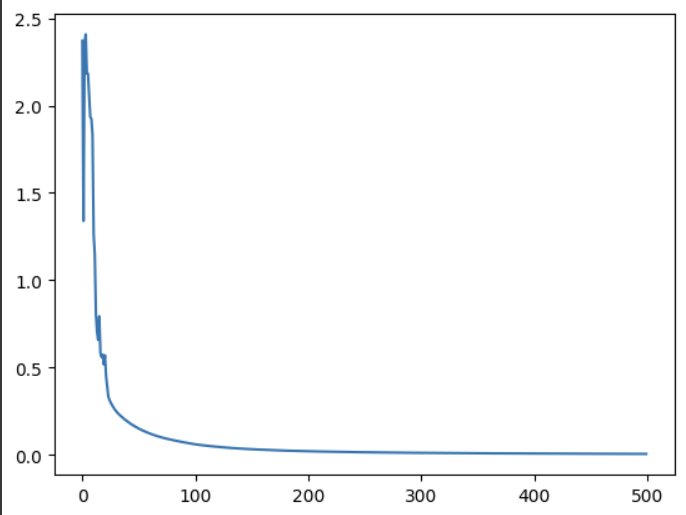
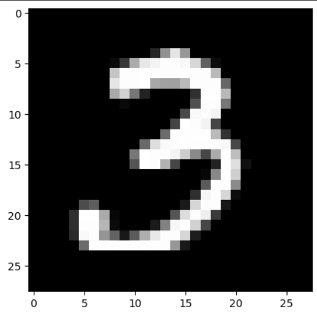

# Single Hidden Layer Neural Network

This repository contains an implementation of a single hidden layer neural network in Python using NumPy. The network is designed for image classification tasks, particularly on datasets where images are represented as 28x28 grayscale pixels.

## Features
- Implements forward and backward propagation
- Uses softmax activation for the output layer
- Supports tanh and ReLU activation functions
- Includes parameter initialization, cost function, and optimization
- Trains using mini-batch gradient descent
- Evaluates accuracy on both training and test sets

## Requirements
- Python 3.x
- NumPy
- Matplotlib

## Usage
1. Load training and testing data from CSV files:
   - `train_X.csv`: Input training images
   - `train_label.csv`: Corresponding labels for training images
   - `test_X.csv`: Input test images
   - `test_label.csv`: Corresponding labels for test images

2. Run the script to train the neural network:
   ```bash
   python Single_hidden_layer_NN.py
   ```
3. The training progress and accuracy will be displayed.
4. The model will also visualize a randomly selected test image and predict its label.

## Training Configuration
- Hidden Layer Size: 1000 neurons
- Learning Rate: 0.03
- Iterations: 500

## Output
- Training accuracy
- Testing accuracy
- Loss curve plot
- Sample predictions on test images

## Example Output
Training Accuracy is: 100%
Testing Accuracy is: 86.2%






Our model says it's: 3


## Author
Developed using Google Colab. If you have any suggestions or improvements, feel free to contribute!

